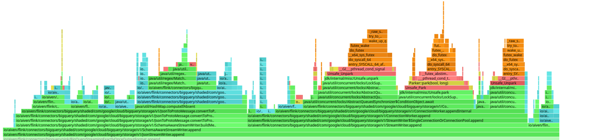
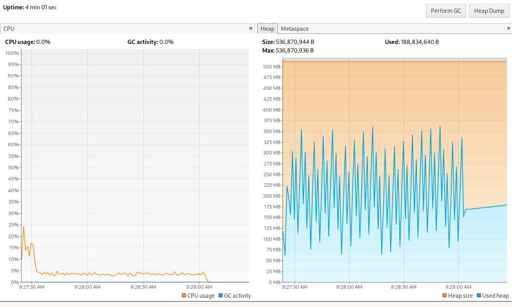

# BigQuery Connector for Apache Flink®

## Compatibility matrix

| Apache Flink | BigQuery Connector for Apache Flink | Release date |
|--------------|-------------------------------------|--------------|
| 1.17.x       | 1.0.0-1.17                          | TBD          |
| 1.16.x       | 1.0.0-1.16                          | TBD          |

To start using BigQuery connector for Flink put `flink-bigquery-connector-<version>.jar`
to `lib/` folder of Apache Flink® and restart Apache Flink®.

## Build locally
```bash
./mvnw clean verify -DskipTests
```
or in case of Windows
```
mvnw clean verify -DskipTests
```
To build with tests it is required to define `BIG_QUERY_SERVICE_ACCOUNT`, `BIG_QUERY_PROJECT_ID` env variables.
`BIG_QUERY_SERVICE_ACCOUNT` contains address to service account to use.
`BIG_QUERY_PROJECT_ID` contains a Google Cloud project id.
Before running tests corresponding dataset and table should be present. 
`io.aiven.flink.connectors.bigquery.PrepareForTests` could be used to create them.

## Example
As a prerequisite there should exist a Google cloud project with name `MyProject` containing `MyDataset` with table `MyTable`.
Also `MyTable` should contain `full_name` field of type `STRING` and `birth_date` of type `DATE`. 
```sql
CREATE TEMPORARY TABLE simple_example (
    `full_name` STRING,
    `birth_date` DATE
) WITH (
    'connector' = 'bigquery',
    'service-account' = <PATH_TO_SERVICE_ACCOUNT>,
    'project-id' = 'MyProject',
    'dataset' = 'MyDataset',
    'table' = 'MyTable'
);
```

```sql
INSERT INTO simple_example VALUES('Newborn Person', current_date);
```

## Arrays and Rows
Same prerequisites about existence of projects/datasets/tables.
Fields for arrays should be marked as `REPEATED` on BigQuery side.
Fields for rows should be `records`.
```sql
CREATE TEMPORARY TABLE array_row_example (
    `numbers` ARRAY<INT>,
    `persons` ROW<name STRING, age INT>
) WITH (
    'connector' = 'bigquery',
    'service-account' = <PATH_TO_SERVICE_ACCOUNT>,
    'project-id' = 'MyProject',
    'dataset' = 'MyDataset',
    'table' = 'MyTable'
);
```

```sql
INSERT INTO array_row_example VALUES(array[1, 2, 3], row('fullname', 123));
```

## Table autocreation
Connector could create datasets and tables in BigQuery based on schema in case there is enough grants for that.
To enable this feature use `'table-create-if-not-exists'='true'` property (`false` by default)
For instance
```sql
CREATE TEMPORARY TABLE array_row_example (
    `numbers` ARRAY<INT>,
    `persons` ROW<name STRING, age INT>
) WITH (
    'connector' = 'bigquery',
    'service-account' = <PATH_TO_SERVICE_ACCOUNT>,
    'project-id' = 'MyProject',
    'dataset' = 'MyDataset',
    'table' = 'MyTable',
    'table-create-if-not-exists'='true'
);
```
If dataset `MyDataset` does not exist connector will create it, same for table `MyTable`
It is worth to mention that Flink's for `ARRAY` type it will create `REPEATED` field in BigQuery,
for Flink's `ROW` type it will create `STRUCT` type in BigQuery. Also depending on nullability specified in schema 
it will create `REQUIRED` or `NULLABLE` type in BigQuery.

## Delivery guarantees

Currently, it provides 2 types of delivery guarantees: `EXACTLY_ONCE` and `AT_LEAST_ONCE`. The default is `AT_LEAST_ONCE`.
To change current value of delivery guarantees use `delivery-guarantee` option like
```
...
WITH (
...
'delivery-guarantee' = 'EXACTLY_ONCE',
...
```

## Performance

Quick performance test gives an idea how fast is it and what are the bottlenecks.

The test of writing data to a single column table. From local machine it takes about 1 min 40 sec to process 1000000 records and about 17 min to process 10x more 10000000 records.
If we look at only connector's related part
there are 2 main CPU consumers: converter from JSON to PROTO and `com.google.cloud.bigquery.storage.v1.ConnectionWorker#maybeWaitForInflightQuota` which makes connector waiting for inflight quota.
At the same time the limitation for inflight quota could be configured via `FlowController`. For instance by default it allows to have 1000 concurrent requests to BigQuery or 100Mb total size of requests.
Some tests show that increasing of number of concurrent requests to 10000 allows to speed up (about 1 min to process 1000000 records). The parameter could be changed via config options.




Since currently data in connector are sending in JSON and then internally converted to PROTO it would make sense to send in PROTO. Probably it is a topic for a separate issue.

Data for tables with larger variety of columns are similar (2 main CPU consumers).


